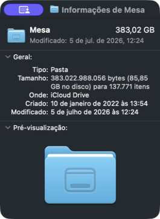
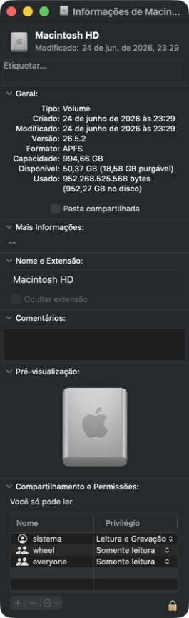
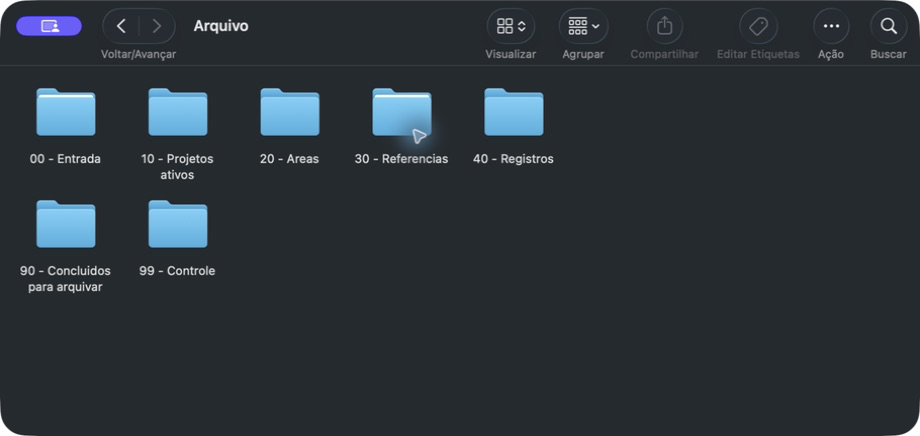

# Organize Files Safely

[Português](README.pt-BR.md)

A macOS-first Codex skill for inventorying, organizing, renaming, and archiving personal files with explicit approval gates. It never deletes files, never overwrites a destination, and keeps real inventories outside Git.

## Real-world baseline

Privacy-reviewed Finder captures from the initial validation Mac. They show aggregate storage pressure without exposing filenames, personal documents, or private inventories.

<p align="center">
  
  
</p>

### Organized result

The local archive root uses numbered lifecycle categories so active projects, ongoing areas, references, records, and completed work remain easy to scan and migrate.

<p align="center">
  
</p>

## Safety model

- Read-only inventory and conservative planning by default.
- Exact batch approval plus `--execute` for same-volume moves.
- Protected handling for symlinks, apps, bundles, DICOM, virtual machines, Git repositories, and cloud placeholders.
- Copy plus SHA-256 verification for external archives; the source remains in place.
- Cleanup reports only. There is no delete command.

## Install locally

```bash
git clone https://github.com/jocielle-tech/organize-files-safely.git
ln -s "$(pwd)/organize-files-safely" ~/.codex/skills/organize-files-safely
python3 ~/.codex/skills/.system/skill-creator/scripts/quick_validate.py \
  ~/.codex/skills/organize-files-safely
```

Public repository: [jocielle-tech/organize-files-safely](https://github.com/jocielle-tech/organize-files-safely).

## First inventory

```bash
python3 organize-files-safely/scripts/organize_files.py inventory \
  --source ~/Downloads --max-depth 2
```

Private output is written to `~/.organize-files-safely/runs/`. Do not commit it.

## Development

```bash
python3 -m unittest discover -s tests -v
python3 ~/.codex/skills/.system/skill-creator/scripts/quick_validate.py \
  ./organize-files-safely
```

## License

MIT. See [LICENSE](LICENSE).
